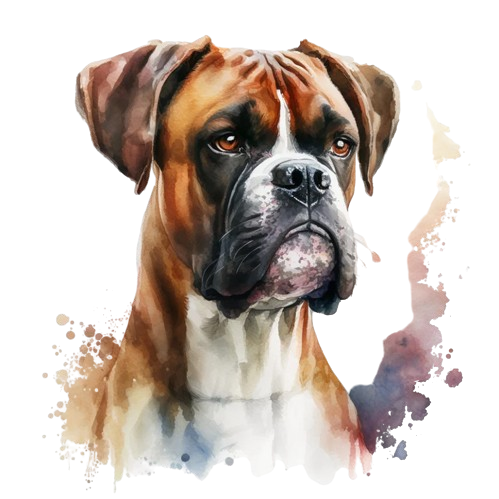

# Mudi the naughty dog

## Purpose of the project 

What software developers generally need is a combination of tools under a single hood. 
I am developing with project architecture tauri, vite and react and those who want to support can send pr.

## Todo List
- [x] Localization Editor
- [ ] App Icon Generator (android, ios and web)
- [ ] File Converter for image,office apss and video format

## Techs
- Tauri V1
- Vite V5
- React V18
- @Mui V5
- wasm
  - ffmpeg
